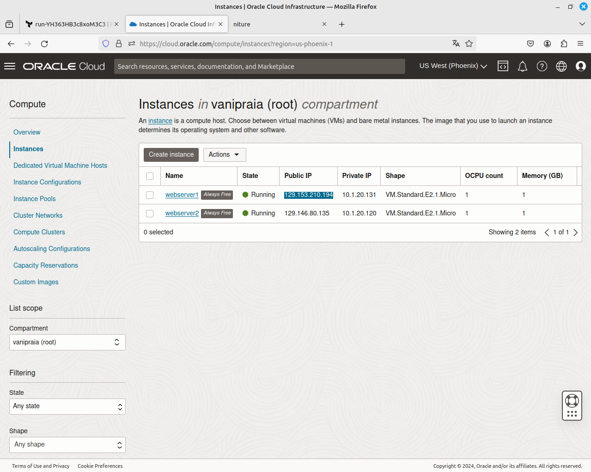
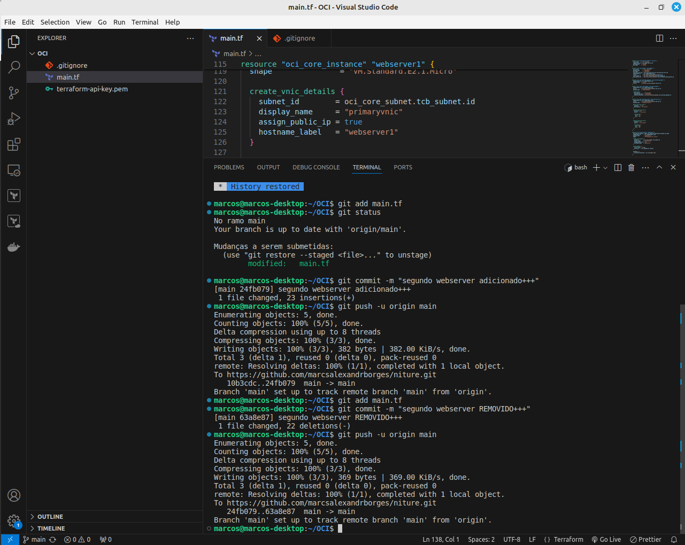
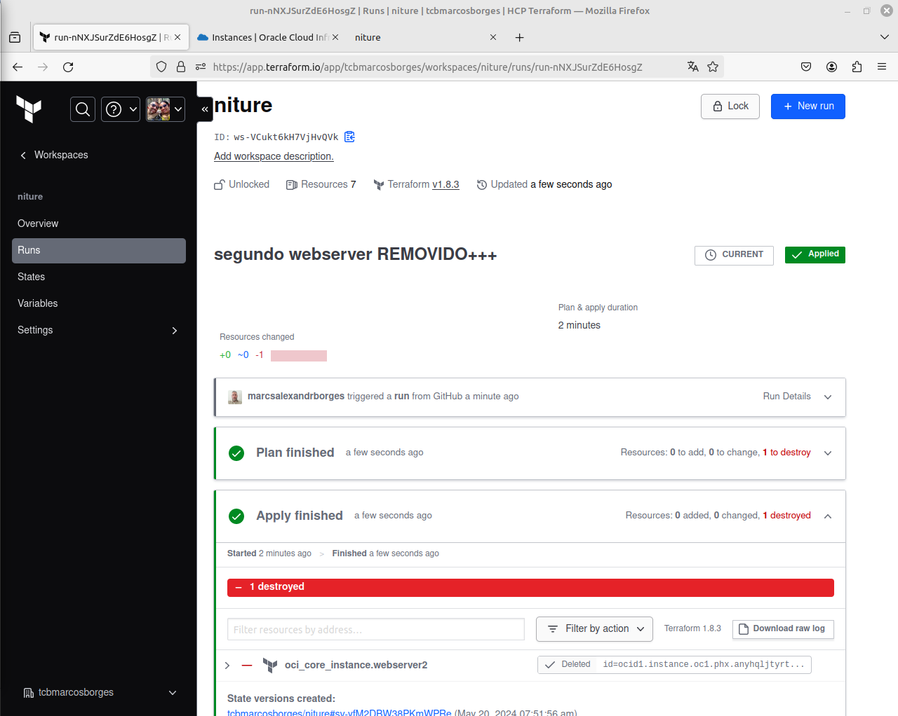
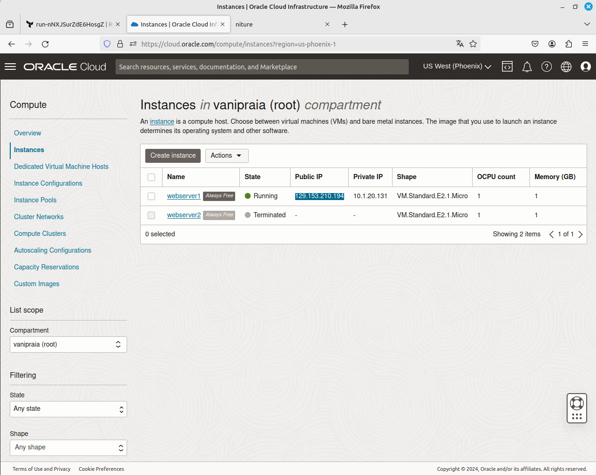

### Título do Projeto: Infraestrutura como Código + Pipeline

Este projeto visa a implementação de recursos de Rede e Compute na Oracle Cloud Infrastructure de forma 100% automatizada, utilizando GitHub, Terraform Cloud e Terraform IaC (Infraestrutura como Código).

#### Visão Geral

Neste projeto, demonstramos como utilizar práticas de Infraestrutura como Código (IaC) e integração contínua/desenvolvimento contínuo (CI/CD) para provisionar e gerenciar recursos de rede e computação na Oracle Cloud Infrastructure (OCI). 

#### Ferramentas Utilizadas

- **GitHub:** Plataforma de hospedagem de código fonte e controle de versão.
- **Terraform Cloud:** Serviço de automação e provisionamento de infraestrutura na nuvem.
- **Terraform IaC:** Ferramenta para definir e provisionar infraestrutura de forma declarativa.

#### Passos para Implementação

1. **Configuração do Ambiente:** Configure as credenciais da Oracle Cloud e do Terraform.
2. **Definição da Infraestrutura:** Utilize arquivos de configuração do Terraform para descrever os recursos desejados na OCI.
3. **Pipeline de Implantação Automatizada:** Configure um pipeline de CI/CD no GitHub para automatizar o processo de implantação.

#### Estrutura do Repositório

- **`/terraform`:** Contém os arquivos de configuração do Terraform para provisionamento da infraestrutura.
- **`/scripts`:** Scripts auxiliares para configuração e automação.
- **`/docs`:** Documentação adicional, guias e referências.

#### Recursos Implementados

- **Rede:** VPCs, subnets, gateways, ACLs.
- **Compute:** Máquinas virtuais, balanceadores de carga, instâncias de banco de dados.

#### Contribuição

Contribuições são bem-vindas! Antes de enviar um pull request, por favor, discuta as mudanças que você deseja fazer através das issues para garantir uma melhor experiência de colaboração.

---

**Nota:** Certifique-se de revisar e entender os custos associados aos recursos provisionados na Oracle Cloud antes de executar este projeto em produção.

